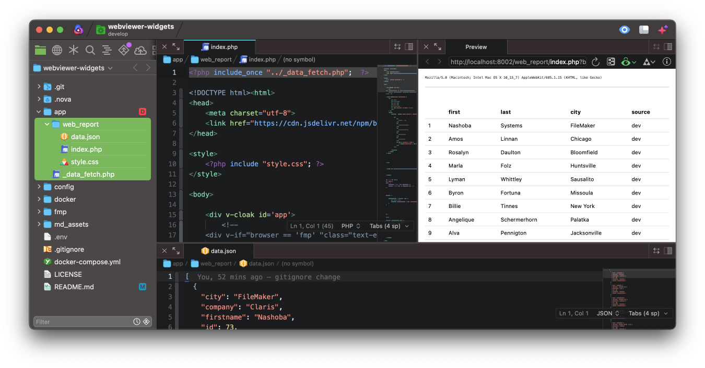

# webviewer-widgets
store and version FileMaker WebViewer HTML. Develop locally in the proper editor with data source logic.


## Challenge
We needed a way to properly edit and version FileMaker (FMP) WebViewer (WV) HTML. We also need a way to control data sources in an editor and when working in a FileMaker dev environment. 

To accomplish this, we turned to php.

### PHP:
Each WebViewer Widget is contained in its own directory. The directory name needs to be the same name as the actual WebViewer name. Inside the directory;

* index.php
* data.json
* style.css

The first line of the index.php file has a php include to the file; ```../_data_fetch.php```

The ```_data_fetch.php``` file has the logic to determine what app loaded the page and what data to render.

> We attempted solving with javascript instead of PHP, but there were permission errors when trying to read the data.json file.
 

### Browser Recognition:
Initially, there was some hope with PHP's ```$_SERVER['HTTP_USER_AGENT']```, which returns 'FileMaker/20.3' inside a WV... but that depended on how the WV was set/loaded. 

The current solution to distinguish what app is loading the page, is to add a URL query;

* FileMaker ; ```?b=fmp```
* editor ; ```?b=dev```





### FileMaker:
Our FileMaker Servers names contain the environment ( dev, staging, production )

The included apps OnFirstWindowOpen script **.env** script will set the ```$$host_env``` based on the server's name. As well as set the Webviewers base url

Each WV should have its own corresponding script that will collect all the required parameters and data to be passed on to common script/function ```webviewer : set ( function ; payload ; webviewer ; method )``` that will render the page.

**method**

```webviewer : set ( function ; payload ; webviewer ; method )``` has two methods to load a WV.

* performscript
* merge


**performscript**  will grab the HTML, set the webviewer and then send the payload via ```Perform JavaScript in Web Viewer```. But the process hangs in some cases (yet to be solved). *[could be when HTML is a reactive framework]*


**merge**; as an alternative to avoid the said issue, grabs the HTML and substitute the string ```"'*|DATA|*'"``` with the $payload. 


### DOCKER:
Included are the basic settings to spin up in docker. ```APP_PORT``` in the .env file should match the port number in the FMP .env script.


### Help:
if there is anyway to improve this please don't hessite 


